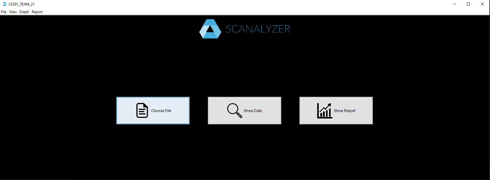
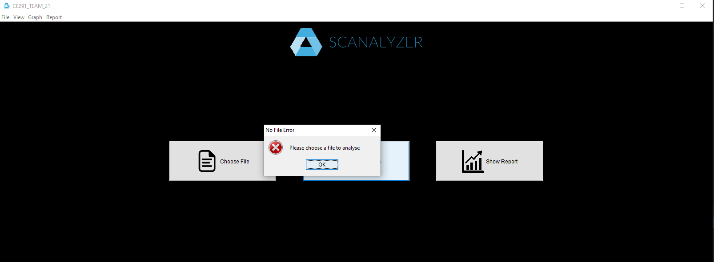
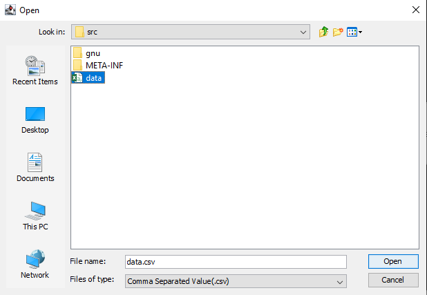
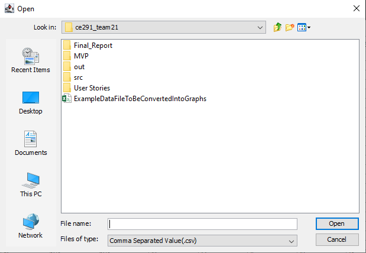
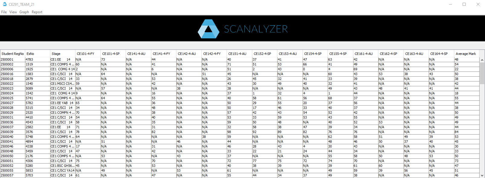
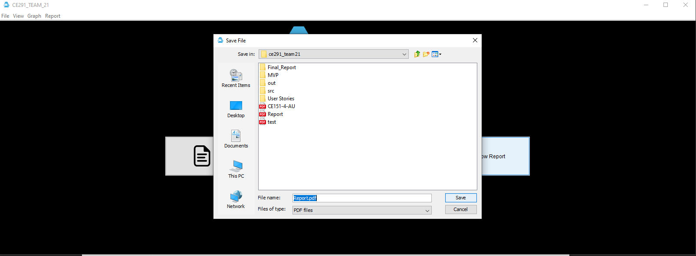
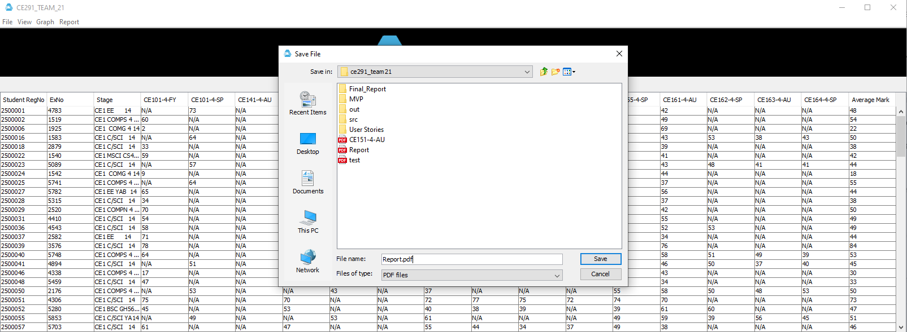
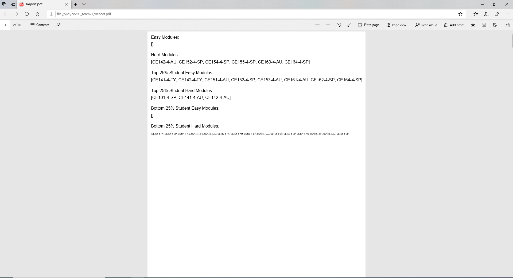
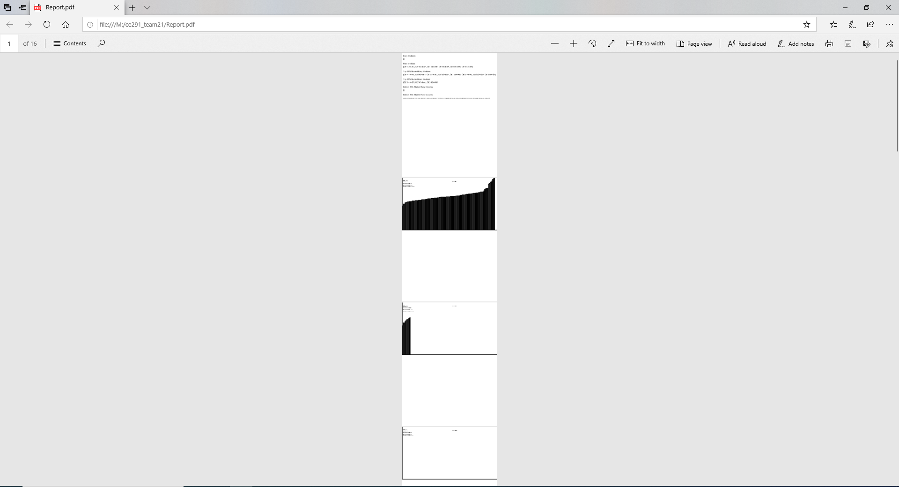

# Product Demonstration Report

*This section should contain a brief description and demo of product you have built.*

* *Include screenshots (actual screenshots, not mock ups) of all of the facets of the product working.*
* *Link consecutive screenshots together with a brief narrative explaining how the product works, e.g. a sentence "Click on OK and it takes you to the next window", "On starting the app, the following window is shown".  This document should not take you a long time to create - it's just pasting photos and adding explanatory sentences between them, so that your MVP is adequately described.*
* *Make sure an image of each window of your software is included - so that a person who has not seen the actual demo of the product has a good idea of what your product currently does.*
* *If your product is a physical device (a hardware product) then you may replace all of the above screenshots by actual photos/vidoes where you feel it is appropriate.*
* *Make sure this section includes any functionality/features you are particularly proud of.*
* *Indicate clearly which parts of the functionality shown in the screenshots are currently incomplete, and what is likely to change in the final version.  For example if a graph displayed is currently based on static hard-coded data for the MVP, but in the future version the graph will dynamically change depending on fresh data, then point this out explicitly.*

## Opening screen
Here is the screen when the program first loads

## 3 Main Buttons (with some tool bar buttons included)
Here is the error shown when the show data or show report buttons are pressed without a loaded file (including all tool bar buttons)

Here is the choose file button pressed. A file containing the data can be selected.

Following on, here is the file toolbar button pressed followed by open.

Here is the show data button pressed. All of the data is shown in a table

Here is the show report button pressed. As you can see the report can be saved as a pdf

Toolbar report button pressed after show data

Here is the report generated after the file is saved for both the main button and toolbar
*front page*

*multiple pages*

These screenshots show