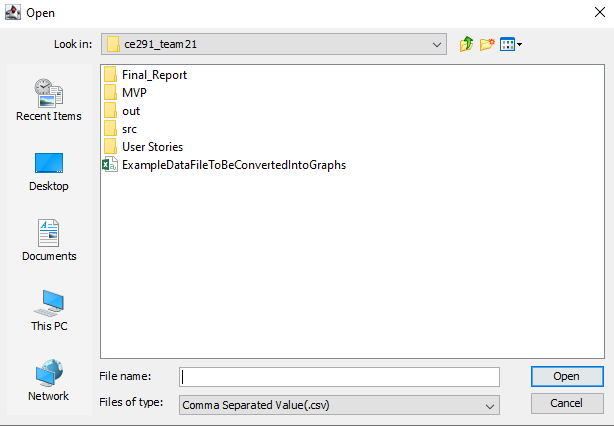
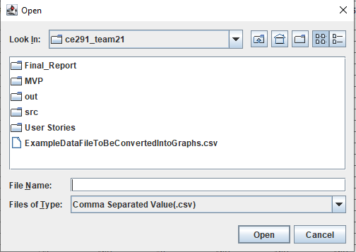
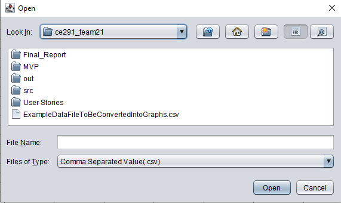
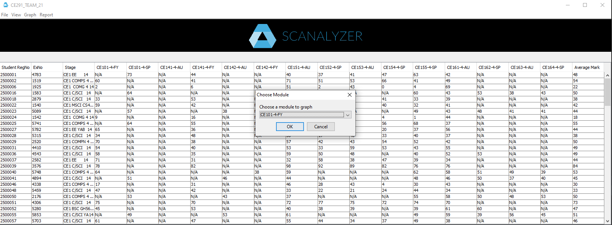
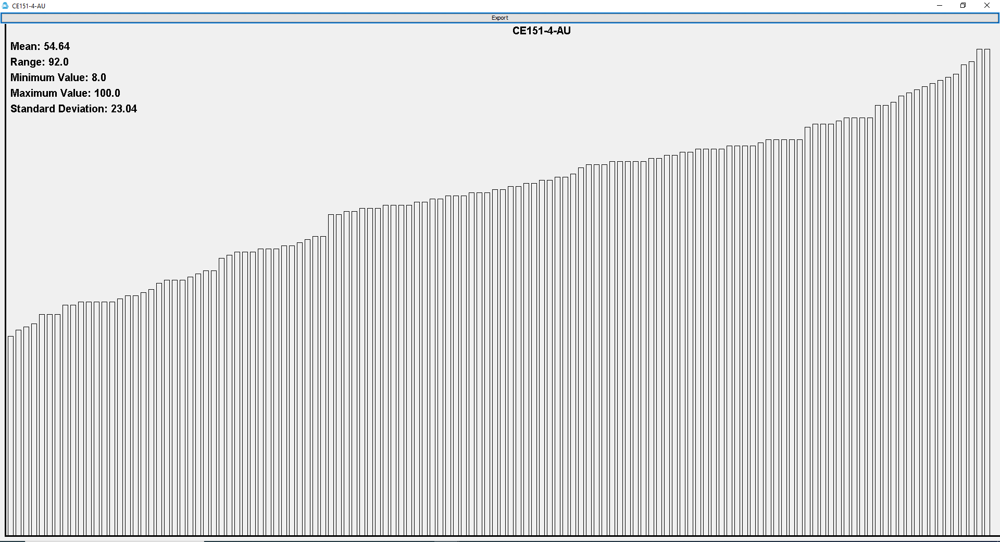
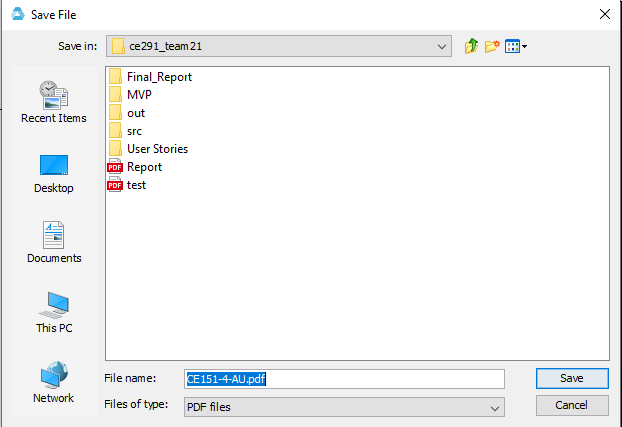
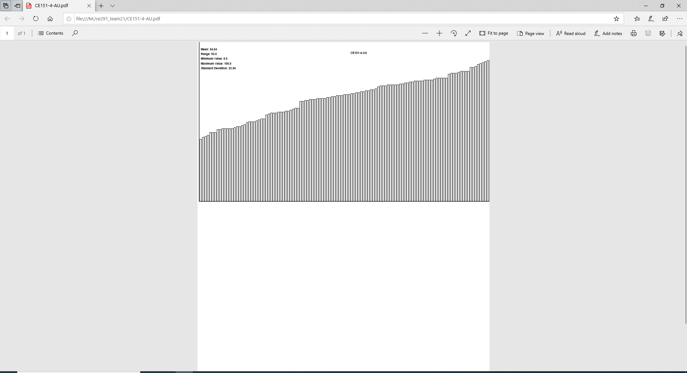
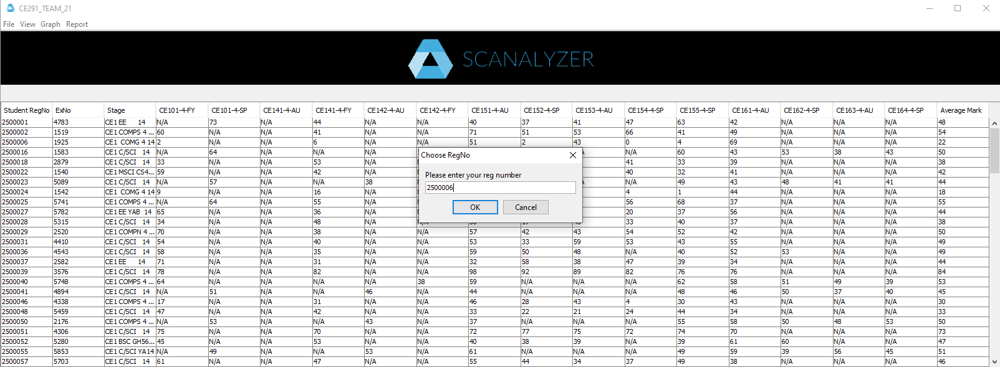
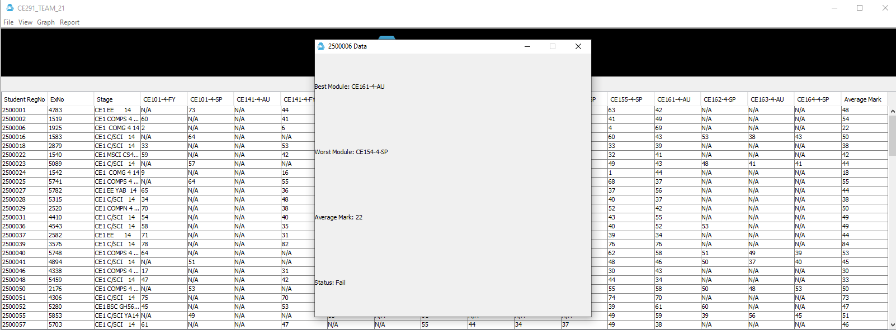

# Product Demonstration Report

## Opening screen
Here is the screen when the program first loads

## 3 Main Buttons (with some tool bar buttons included)
Here is the error shown when the show data or show report buttons are pressed without a loaded file (including all tool bar buttons)

Here is the choose file button pressed. A file containing the data can be selected.

Following on, here is the file toolbar button pressed followed by open.

Here is the show data button pressed. All of the data is shown in a table

Here is the show report button pressed. As you can see the report can be saved as a pdf

Toolbar report button pressed after show data

Here is the report generated after the file is saved for both the main button and toolbar

FRONT PAGE

MULTIPLE PAGES

## Remaining Toolbar Buttons
These screenshots show the 3 different themes that can be selected when view is pressed. They alter the look of the file chooser.

SYSTEM

METAL

NIMBUS

Here is when graph, then module is clicked on the toolbar

And here is when a module is selected

Here is when you click to export the graph, you can name and save the file

And here is the outputted PDF

Here is when graph, then student is clicked on the toolbar

And here is the output after typing in a student's registration number
