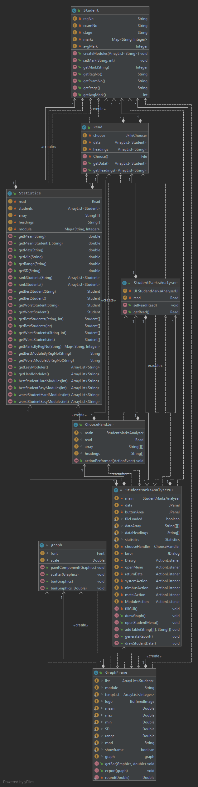
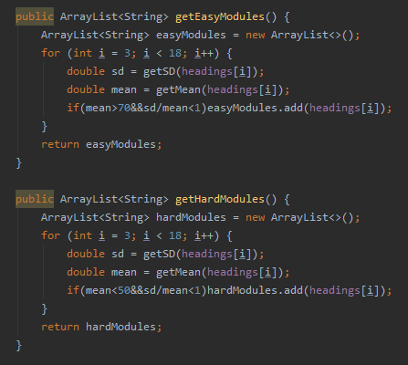

# Team Implementation Report

## Technical Diagrams
Class Diagram

## Technical Description
*This section should describe the software implementation in prose form.  Focus on how the code was designed and built.* 
*It should make a clear description that could be used by any future developers to maintain and extend your code, if necessary.*
*Describe important functions / classes / class hierarchies.*
*In this section, you should also wish to highlight any technical achievements your team is particularly proud of, including relevant code snippets.*
A main class named StudentMarksAnalyser is used to store key components of the program including the UI(StudentMarksAnalyserUI) and the Read class and allow these to be used all
throughout the program. The Read class handles the reading and storing of the data from the excel file including using a handler class (choose handler) to handle the selecting of
the file. The read object instantiated on file choosing stores the data and headings of the file for use throughout the program. The data stored within the read object is a list
of student objects which are created within this class. The student class is one to store information about a particular student and through accessing the array, along with the
methods of the student class, data can be manipulated to achieve the desired results (e.g. outputting to the report). This data manipulation is achieved through a very important
class named statistics which has many methods for processing the data, including finding the mean, standard deviation, best students, worst students, hard modules, easy modules
and a lot more useful statistical analysis. A particularly good technical achievement is the code for finding the hard/easy modules (screenshot below with description). 

All of the described above is crucial processing of the program; however, a very important class is the UI. The UI handles the input from the user using event driven programming
with action listeners for many buttons and is also vital in outputting the relevant information to the user. This allows all of the processing above to come together though input 
of processes to follow from buttons and output of the very importantstatistical data. The UI works together with a graph and graph frame class that handle the formatting of the 
graph to be created when selected by the user and output on the UI. This also works with generation of a PDF upon user request which can contain these graphs including text of 
the useful statistical data.

This code uses the mean of the modules including the standard deviation to calculate a coefficent of variation (standard deviation over the mean) and compare this to a mark to 
decide whether a module is too easy or too hard. Essentially, if the mark is large and the coefficient of variation is less than 1 then the module is easy. If the mark is small
small and the coefficient of variation is less than 1 then the module is hard. The coefficient of variation is very important as it basically states whether most students are
achieving around the same mark meaning that if everyone is achieving very high or very low then the module is easy/hard. If the coefficient of variation is greater than 1 then
the marks are so spread out meaning that the module is easy for some students and hard for others rather than leaning to one side.

## Algorithms and Data Structures
A class *student* exists to store all the information about each student read from the file. Various attributes of varying types are used to store the data such as a string for the registration number.
The most complex data structure used to store the marks of each student is a hashmap. This maps a String as the key to an Integer as the value (a module code to a mark). To retrieve 
the mark the module code is given as the key and the corresponding value is retrieved from the map for use. The space complexity for a hashmap is O(n), that is the space required to
store the data linearly increases as the amount of entries stored within the map increases. Likewise, the time complexity of the Hashmap is O(1) which is very efficient as the time
to find the value given the key is minimal. This is assuming the hash function is implemented very well meaning the buckets are well distributed leaving only the time to process the
hash function to retrieve or add data.

Within the program where statistics are process a mergesort algorithm is used with the "Arrays.sort" function and then the "Arrays.reverse" function to sort the students from best to worst.
The students are sorted by their average mark through the use of comparator causing the sort to be merge sort which has time complexity O(nlogn) and space complexity O(n). This is
a very efficient sorting algorithm when sorting objects by one of their values (in this case Student's average mark). It divides all arrays in half until many sub arrays are created
and sorts the values when merging the arrays back together. E.g. [7,3,12,4] becomes [7,3], [12,4] [7],[3],[12],4] [3,7], [4,12] and finally [3,4,7,12]. Due to the maximum amounr of
sub arrays being equal to the number of values to sort, the space complexity is O(n) which increases in a linear fashion with more values.

## Imported Libraries 
*List any 3rd party libraries that were used and describe what functionality they provided.*
The third party library that was used in our product is called JPDF. This library was used to export statistical data to a pdf. The processing of our statistics is outputted using
graphics objects where each graphics object drawn is one page of the pdf. This includes the "drawing" of text and graphs.