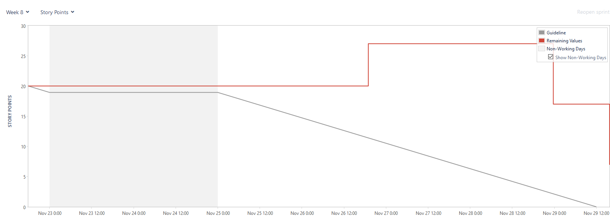
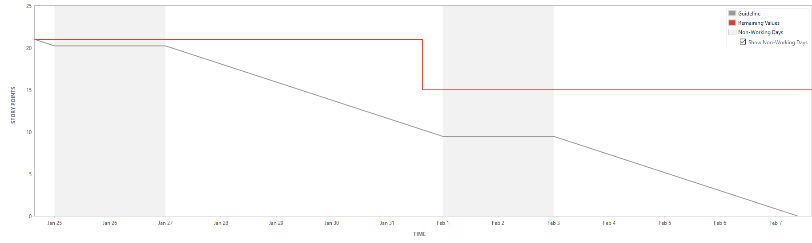
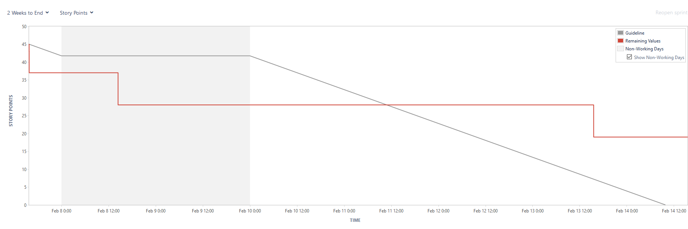
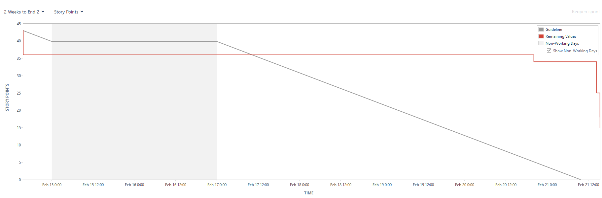

# Project Management Log

## Project Management Discussion 

Generally, we have been able to work successfully and collaboratively to create a project which reaches the goals that we set out to achieve, and produce a piece of software which works to a decent standard and is of decent quality. 

One of our biggest strengths has been that we have been able to effiectively communicate. This has meant that we have had a clear vision of what functions we want the software to be able to perform. We have also been able to be organised in terms of meeting deadlines. 

Another strength that we have had is that we have been able to use version control software effectively. This has meant that we have been able to work on code without getting in each others way, make expermintal changes that are not permanent and work together to solve problems. One example of this in the program was calculating statistics, where we were able to build in the initial code that someone had written to add more reliablity, stability and accessabilty to the code. 

 However, there have certainly been aspects which could have been handled better. 

One issue in particular is that the program in some places has been built using some poor coding practices. This has made it diffcult to be able to make changes, fixes and add features efficiently due to a lack of a proper organisation structure. This issue has appeared because of a lack of organisation amongst the team. We should have used the organisational tools available to ensure that we had a clear idea of what the structure of the program before we began writing the program.  

Another issue that we have had regards the use of jira. During the module, we were learning how to effectively use jira to organise ourselves and some mistakes were made along the way. This means that some of our burndown charts do not accurately reflect the amount of work we have actually completed. 

  
## Sprint Burndown Charts

### Week 8

## Weeks 17-19

## Week 20

## Week 21

  

## Burndown-Charts Discussion

### Week 8 
In week 8, not much work was set as it was straight after the hand in of the MVP work, and we did not have a solid plan of how to continue with the program. 

Unfortunately, we did not reach zero story points by the end of the sprint and at some point the number of story points actually increased due to a task being added after the sprint had started. 

Also some poorly written tasks and stories meant that some of the story points could not have been completed. 

The graph also follows a general trend that most work is completed towards the end of the week. 

### Weeks 17-19

We decided to combine the weeks 17-19 of the project as there were long tasks that needed to be done and we had to get back into the rhythm of work. 

Unfortunately, we were far away from our goal in terms of story points. This is because many of the tasks for that particular week could not be completed. 

Ulimately, not enough work was completed in this period, and work that was completed was not reported on jira properly. We should have worked more on ensuring that we had a clear vision of what the program should look like as well as keeping a clear log of completed work. 

### Week 20 

Although we still didn't reach the story point target in week 20, we made better and more gradual progress on jira. 

This was because of more accurate reporting of work completed on jira, as well as the creation of better tasks and stories. 

Unfortunately, at the end of that sprint, there were many issues that were readded to the backlog. This was because most of the subtasks inside of some stories weere completed, however a few of them were not completed, meaning that work completed inside of these stories was reflected in the burndown charts. 

### Week 21 

The definitive feature of the week 21 burndown image is that there is a large decline in story points towards the end of the graph. One of the major issues that the team has is that much of the work for each sprint is completed at the end of the sprints. While it leads to a poor quality of burndown charts, the beggest issue is that if a team member is struggling, there is no good oppertunity to help them so that the targets can be met. 

In this sprint, we were close to achieving 0 story points for the overall sprint by the end. We did not reach the target because there were some tasks that we decided not to complete, such as the implementation of unit testing. Before adding items to a sprint, we should have made sure that we had prioritised properly. 

