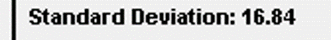

# Test Report

## Testing performed

Regarding the testing of the program, it is difficult to determine much testing criteria. This is because there are not many parts of it that should provide a specific outcome

### Criteria 1: Mean Calculations for modules

One of the tasks necessary was to calculate the mean average of entries for each module in the csv file. This could be easily tested due to the feature in Microsoft Excel that uses a function to calculate the mean of data in one column.

#### Test 1: CE101-4-FY

##### Expected Result

56

##### Actual Result

#### Test 2: CE152-4-SP

##### Expected
  49.853
##### Actual

#### Test 3: CE161-4-AU
###### Expected
54.904
###### Actual

### Criteria 2: Standard deviation for modules

The testing for the standard deviation will use the same method as the mean.

#### Test 1: CE101-4-FY

##### Expected Result

16.766

##### Actual

#### Test 2: CE152-4-SP

##### Expected

25.040

##### Actual

#### Test 3: CE161-4-AU

##### Expected

17.277

##### Actual

